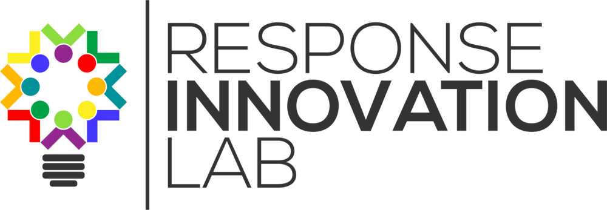

## PLEmis Documentation

This documentation outlines the specifications for installation, usage and integration of the PL-EMIS system.

## Partners 

###### Web Dashboard 
http://pl-emis.com/dtsweb
###### Mobile Application
https://play.google.com/store/apps/details?id=com.wvsomdigital.org
###### Technical Documentation
[Technical Testing Report](./docs/index.md)

